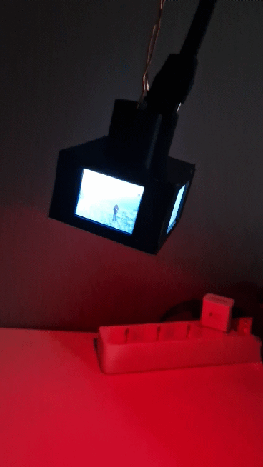

# Jumbotron



In this project I built a miniature "Jumbotron", you know the cool displays that are in the center of sport arenas, that has a display on each side. I built this because I "needed" a small jumbotron for a gingerbread house!

The jumbotron is controlled by a Raspberry Pi 4 which starts a webserver that allows you to upload videos that you can then play on the displays. While the Raspberry Pi 4 is quite overkill to simply show an image on the displays, it turned out to be very useful because I could simply use Python and PILLOW to work with images, and the Pi can also do a bunch of image processing, which would be more difficult on something like an ESP32.

A video is played as follows:
1. The uploaded video is turned into `.jpg` images with `ffmpeg`. For the video to play at the correct framerate, we need to remember how many frames per second we divide the video into from this step.
This can be done with: ` ffmpeg -i ${VIDEO} -r ${FPS} -f image2 ${OUTPUT}/image-%3d.jpg`
2. Each `.jpg` image is loaded into Python with `PIL` and resized to match the width and height of the display.
3. Once all images has been processed, they are saved to cache with `pickle` so we don't need to do this step again, since it takes some time.
4. The images are sent to the displays, 1 at the time. Note that for these displays we don't need the MISO pin, so we can actually attach all the displays to the same wires, which means that they show the exact same image, at exactly the same time!
5. Once the last frame has been displayed, the video repeats itself.

I also added some WS2812 RGB LEDs at the bottom of the jumbotron, so we can have some disco!
To play a LED sequence, I made a simple csv-format, which looks like:
```
color, time, led_nbr (0 = all)
#000000, 0.0, 0
#ff0000, 0.0, 1
...
```
A csv file can be given to the `LedPlayer`, which then shows the led sequence.

The only components for the project are:
| Component | Description |
| --- | --- |
| Raspberry Pi 4 | Main brain & controller |
| SPI TFT 1.77 inch Display x3 | Shows the images |
| WS2812 x4 | To give some nice party LEDs |

The case is 3D-printed and designed in FreeCad. All model files can be found in the `cad/` directory.

## Wire connection (Mostly for myself to remember)
1. GND
2. 5V
3. SCK (SPI Clock)
4. SDA (SPI MOSI)
5. RES (Reset)
6. RS
7. CS (SPI CS, Chip Select)
8. LEDA (Background light)
9. WS2812 LED data

## Pin connections
| Pin number | Meaning | Pin on Raspberry pi | Color (on my wires) |
| --- | --- | --- | --- |
| 1 | GND | GND | Black |
| 2 | 5V | 5V | |
| 3 | SCK (SPI Clock) | GPIO11 (SPI0_CLK) | |
| 4 | SDA (SPI MOSI) | GPIO10 (SPI0_MOSI) | |
| 5 | RES (Reset) | GPIO25 | |
| 6 | RS | GPIO24 | |
| 7 | CS (SPI CS, Chip Select) | GPIO8 (SPI0_CE0_N) | |
| 8 | LEDA (Background light) | 3V | |
| 9 | WS2812 LED data | GPIO12 (PWM) | Red |